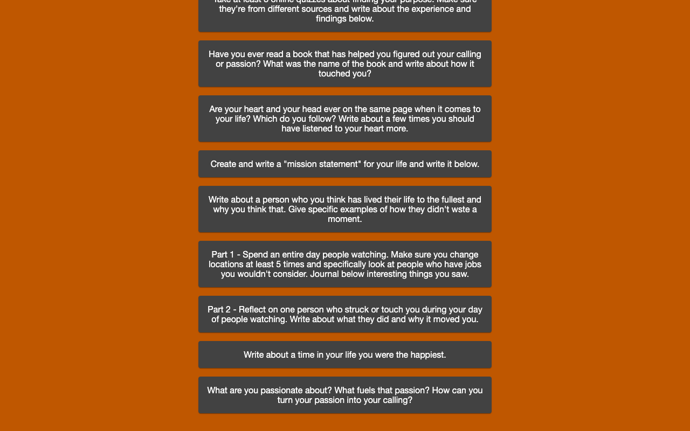
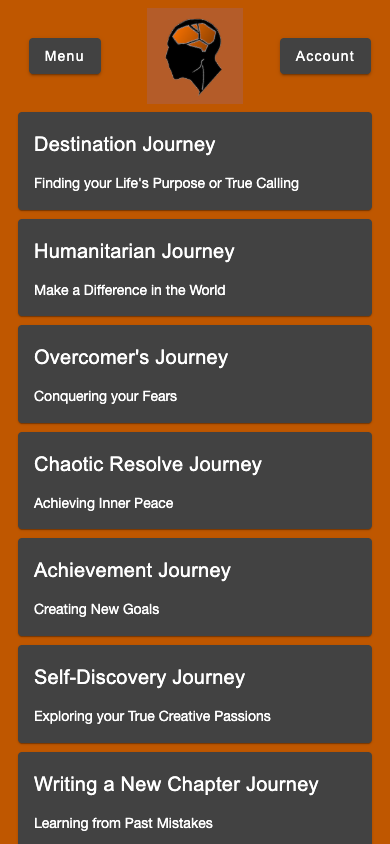

# Andoria — Existential Thinker

A guided reflection app for exploring life questions and writing personal answers. The Angular interface groups questions into journeys and stores account and reflection data through [Endoria](https://github.com/TheArchitect71/Endoria).

## What you can do

- Explore journey questions with incremental loading and restored scroll position.
- Create an account, log in, and manage your profile.
- Save and delete your own reflections.

## Preview



Captured from the running application on September 30, 2026. Any sample records shown are demonstration or isolated test data, not data included with a fresh installation.

<details>
<summary>Mobile view</summary>



</details>

## Run locally

Use the Node version in `.nvmrc` (currently 26.10.0) and npm. Run these commands from the repository root.

Start **Endoria** first, following its README. The API runs on port 8000 with local MongoDB on port 27018. Clone the backend beside this frontend.

```sh
nvm use  # if you manage Node with nvm
npm ci
npm start
```

Open [http://127.0.0.1:4200](http://127.0.0.1:4200). Keep the server in the foreground; stop it with **Ctrl+C**.

## Current scope

A fresh Endoria database contains no questions; use an appropriate question dataset to populate the journeys. Password reset and the Edit-answer menu are unfinished placeholders. Saving and deleting reflections are implemented.

## Development

```sh
npm run build
npm run typecheck
npm test -- --browsers=ChromeHeadless
```

Browser tests require Chrome or Chromium; set `CHROME_BIN` if it is outside the standard installation path. Angular 22 currently requires TypeScript 6.0.x. The Jasmine 6 test dependencies are retained for compatibility with Zone.js.
